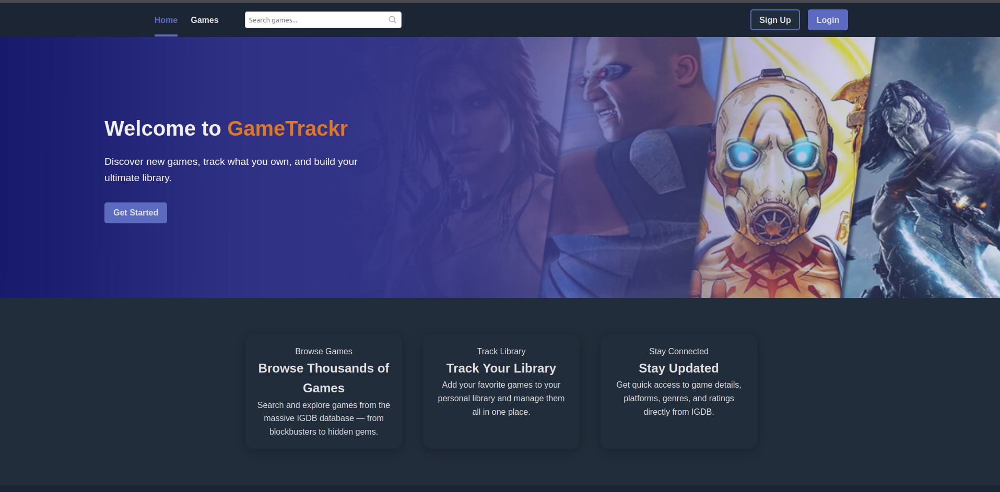
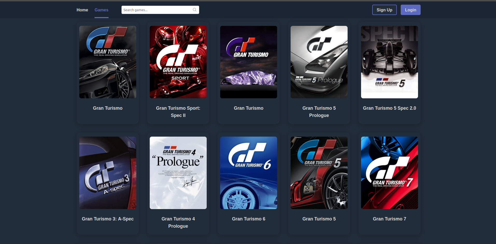
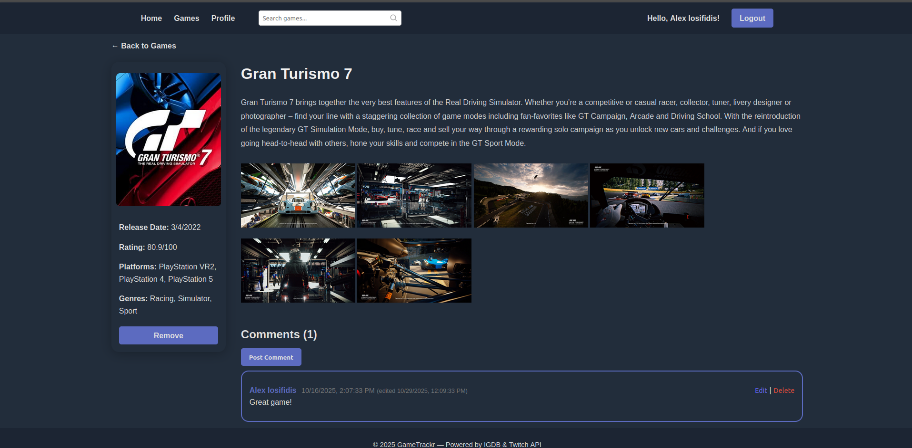
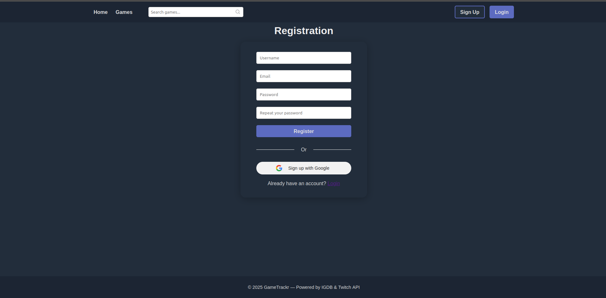

# Game Trackr

Express + EJS app to browse and track video games (IGDB).  
Dark-themed UI with card-style game listings, search, pagination and session-based authentication.

## Project Status

This web application is still a work in progress.

---

## Features
- Browse games (IGDB API)
- Search games
- Pagination (49 items per page)
- Game cards with cover art, release date and engine (if available)
- Session-based login/logout with Google Authentication
- EJS templates (views)
- Custom dark CSS (no Tailwind required)

## Live Demo

View the live site: [Game Trackr](https://game-trackr.up.railway.app)

## Screenshots

### Home Page


### Game List


### Game Details


### Registration Form


---

## Repo structure
```
/ (project root)
├─ index.js                # Express app entry
├─ package.json
├─ .env                    # local environment variables (not in repo)
├─ public/
│  ├─ style.css            # custom dark theme + cards CSS
│  └─ images/
├─ views/
│  ├─ games.ejs
│  ├─ game.ejs
│  ├─ home.ejs
│  ├─ login.ejs
│  ├─ register.ejs
│  └─ partials/
│     ├─ header.ejs
│     └─ footer.ejs
└─ README.md
```

---

## Prerequisites
- Node.js (recommended LTS: 18 or 20) — v22+ or v24 may cause some third-party issues
- npm
- (Optional) PostgreSQL if using DB-backed users

---

## Environment variables

Create a `.env` file in project root. Example:

```env
# filepath: /home/lozfunk/Projects/game-trackr/.env
PORT=3000
SESSION_SECRET=your_session_secret_here

# IGDB / Twitch (required for IGDB API)
TWITCH_CLIENT_ID=your_twitch_client_id
TWITCH_CLIENT_SECRET=your_twitch_client_secret

# Postgres (if used)
PG_USER=your_pg_user
PG_HOST=localhost
PG_DATABASE=your_db
PG_PASSWORD=your_db_password
PG_PORT=5432
```

Notes:
- IGDB requires a Twitch OAuth token. The app exchanges client id + secret for a token.
- Keep `.env` out of source control.

---

## Install

From project root:

```sh
npm install
```

If you prefer hot reload during development:

```sh
npx nodemon index.js
```
(or add a script to package.json: `"dev": "nodemon index.js"`)

---

## Run

Start the app:

```sh
node index.js
```

or with nodemon:

```sh
npx nodemon index.js
```

Open http://localhost:3000 (or the value of `PORT`).

---

## Routes (overview)

- GET /            — home page
- GET /games       — games list (query params: `page`, `search`)
- GET /game/:id    — game detail page
- GET /login       — login form
- POST /login      — login handler
- GET /logout      — logout
- GET /register    — registration (if implemented)

Pagination & search:
- `GET /games?page=2&search=zelda` — page numbers shown in UI, arrows for prev/next.

---

## Views & Styling

- Views are EJS templates in `views/`.
- Custom dark theme CSS in `public/style.css`.
- Ensure static files are served in `index.js`:
```js
app.use(express.static('public'));
```
- Ensure `header.ejs` links the stylesheet:
```html
<link rel="stylesheet" href="/style.css">
```

Troubleshooting: if styling does not appear, check browser DevTools Network tab for `style.css` (status 200) and confirm link path matches `public/` folder.

---

## IGDB integration notes
- The app uses Twitch OAuth (client credentials) to get a bearer token, then queries IGDB `/v4/games` using POST with IGDB query language (e.g. `fields name,cover.url,first_release_date; limit 49; offset 0;`).
- If you add more fields (e.g., engines), request `game_engines.name` and ensure nested fetches are handled if API returns IDs.

---

## Authentication
- Session-based auth using `express-session`.
- Example simple flow:
  - POST /login validates credentials (DB or in-memory), sets `req.session.user`.
  - Protect routes with middleware:
    ```js
    function requireLogin(req, res, next){
      if (req.session && req.session.user) next();
      else res.redirect('/login');
    }
    ```

---

## Adding engine to cards
- Update IGDB fields in fetch to include `game_engines.name` and render `game.game_engines` in `games.ejs`.

---

## Pagination implementation (notes)
- The app fetches a page of results (limit 49). IGDB may not provide total count reliably — UI shows a sliding window around the current page (e.g., current ± 2 pages), with `←` and `→` arrows linking to prev/next when available.

---

## Contributing
- Open issues for bugs or feature requests.
- PRs should include minimal, focused changes and be tested locally.
- Keep secrets out of PRs.

---

## License
Add license text or file (e.g., MIT) as appropriate.

---
